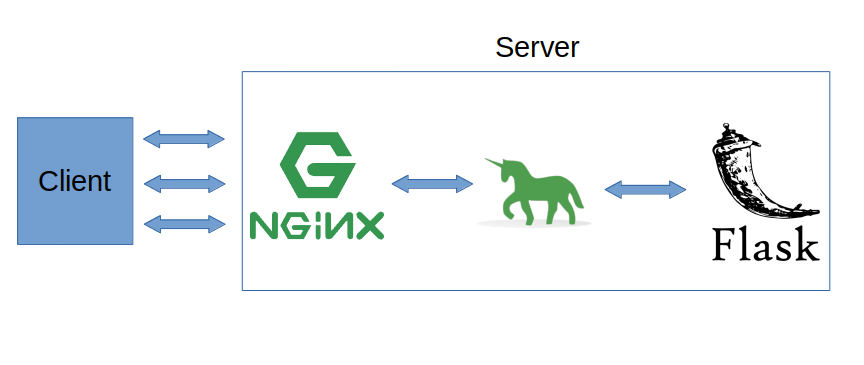

Connecting Flask and Gunicorn to Nginx with docker-compose
==========================================================

Quick tutorial on how to server requests to nginx with Flask through the use of Nginx.

Setup
=====

Install docker and docker-compose

- https://docs.docker.com/get-docker/
- https://docs.docker.com/compose/install/
